<!-- Generated by GitHub Profile Agent Console. Edit profile.config.json, then run npm run generate. -->

  <picture>
    <source media="(max-width: 760px) and (prefers-color-scheme: dark)" srcset="./assets/hero/agent-console-91d9df1e-mobile-dark.svg">
    <source media="(max-width: 760px)" srcset="./assets/hero/agent-console-91d9df1e-mobile-light.svg">
    <source media="(prefers-color-scheme: dark)" srcset="./assets/hero/agent-console-91d9df1e-dark.svg">
    <source media="(prefers-color-scheme: light)" srcset="./assets/hero/agent-console-91d9df1e-light.svg">
    
  </picture>

  
  
  

## About Me

I'm a software developer with over two years of experience. I started out in Chemical Engineering, but found my true passion in web development.

I focus on building clean, thoughtful web applications end-to-end with modern tools like Next.js, TypeScript, and PostgreSQL, always learning along the way.

## Current Focus

| Area | What I am exploring |
| --- | --- |
| **Full-Stack Web Apps** | Building end-to-end web applications with Next.js, TypeScript, and PostgreSQL. |
| **API Development** | Designing and building REST APIs with Node.js, Hono, and Prisma. |
| **Developer Workflow** | Using Docker, Bun, and modern tooling to ship reliable software faster. |

## Featured Work

| Project | Focus | Why it matters |
| --- | --- | --- |
| [**salasa.id**](https://github.com/salasaa/salasa.id) | Personal portfolio website | Personal portfolio and website built with Next.js and TypeScript to showcase projects and professional background. [Live](https://salasa.id) |
| [**cartify**](https://github.com/salasaa/cartify) | Grocery list web app | A grocery list application built with React and TypeScript for organizing daily shopping needs. |
| [**cartify-api**](https://github.com/salasaa/cartify-api) | Groceries REST API | REST API service providing grocery and daily-needs information, built with TypeScript. |
| [**linkup.salasa.id**](https://github.com/salasaa/linkup.salasa.id) | Simple contact book | A simple contact book web app built with HTML for managing personal contacts. |

## Research Direction

I focus on building reliable web systems end-to-end, from database design and APIs to polished, responsive interfaces, using tools like Next.js, TypeScript, and PostgreSQL.

## Tech Stack

`Next.js` · `TypeScript` · `React` · `Node.js` · `PostgreSQL` · `Prisma` · `Hono` · `Tailwind` · `Docker` · `Bun`

## Recent Activity

<!-- AUTO:ACTIVITY:START -->
_Recent public activity will appear here after the workflow runs._
<!-- AUTO:ACTIVITY:END -->

---

  Building clean, thoughtful web applications and always learning.

